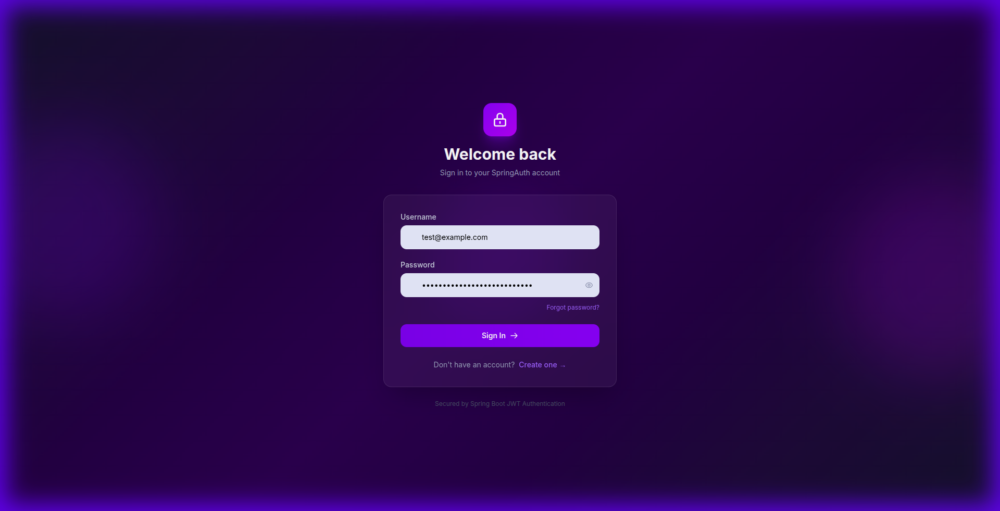
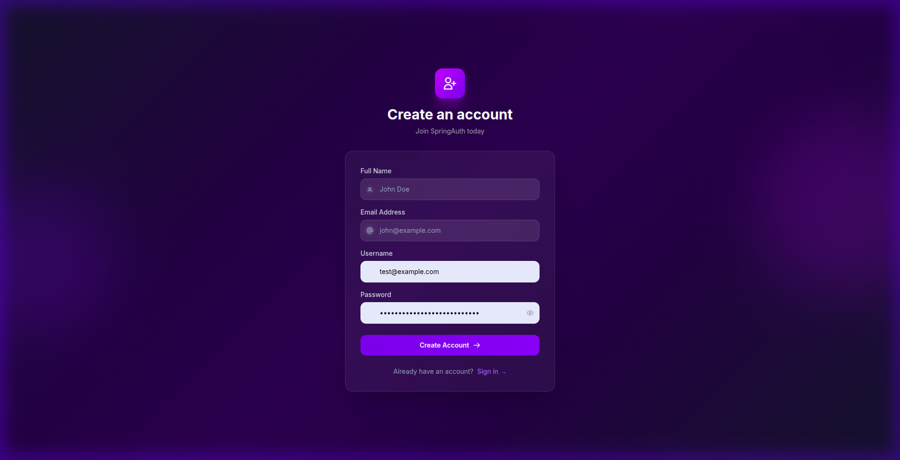
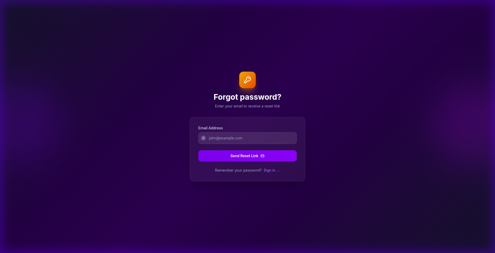

# Auth User Management System

A full-stack authentication and user management system built with **Spring Boot** (Backend) and **Angular** (Frontend). This system implements secure JWT-based authentication, user registration, and password recovery.

## ✨ Features
- **Modern UI**: A sleek, dark-themed interface built with Angular and Vanilla CSS.
- **JWT Authentication**: Secure stateless authentication using JSON Web Tokens.
- **User Registration**: Easy-to-use sign-up flow with validation.
- **Password Recovery**: Robust forgot/reset password mechanism.
- **Responsive Design**: Fully responsive layout that works on all devices.
- **Dockerized**: Easy deployment using Docker and Docker Compose.

## 📸 Screenshots

### Login Page

*Modern login interface with secure credential handling.*

### Registration Page

*Detailed registration form with user data validation.*

### Forgot Password

*User-friendly password recovery flow.*

## 🚀 Getting Started

### Prerequisites
- Docker & Docker Compose

### Running the Application
1. Clone the repository:
   ```bash
   git clone https://github.com/hellohridoy/auth-user-management-system.git
   ```
2. Navigate to the project directory:
   ```bash
   cd auth-user-management-system
   ```
3. Start the system using Docker Compose:
   ```bash
   docker-compose up -d
   ```
4. Access the frontend at `http://localhost:4200`.

## 🛠️ Tech Stack
- **Backend**: Java, Spring Boot, Spring Security, JWT, Maven.
- **Frontend**: Angular, CSS, HTML.
- **Infrastructure**: Docker, Docker Compose, Nginx.
